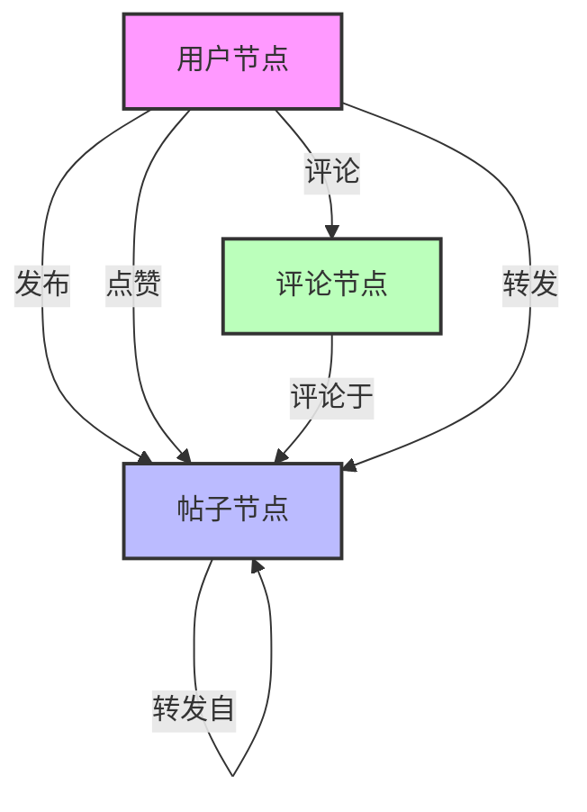

## 微博社交圈分析：
已实现功能：
* 爬取指定微博用户的微博评论、转发、点赞等信息，并存储到Neo4j数据库中；
* 根据用户间的互动程度，提取关联度较高的关系，形成简化后的networkx图

  
### 环境要求：

```
Python 3.11+
Neo4j 4.0+
pip install -r requirements.txt
```


### 1. 启动Neo4j容器

使用Docker运行Neo4j数据库：

```bash
docker run \
    --name neo4j \
    -p 7474:7474 -p 7687:7687 \
    -d \
    neo4j
```

容器启动后，可以通过以下方式访问：

- Neo4j Browser界面：http://localhost:7474
- Bolt连接地址：bolt://localhost:7687

确保Neo4j容器正常运行后，再继续后续步骤。

### 2. 配置文件

添加.env文件，配置以下信息：

```bash
NEO4J_URI=bolt://localhost:7687
NEO4J_USER=your username
NEO4J_PASSWORD=your password
```

添加cookies.json文件，填入你的微博的cookies：

```json
{
  "SINAGLOBAL": "",
  "UOR": "",
  "SCF": "",
  "XSRF-TOKEN": "",
  "SUB": "",
  "SUBP": "",
  "ALF": "",
  "_s_tentry": "",
  "Apache": "",
  "ULV": "",
  "WBPSESS": ""
}
```

请将从浏览器中获取的微博cookies填入对应字段。

### 3. 运行爬虫

使用以下命令运行爬虫：

```bash
python main.py -u xxxxxx
```

其中：

- -u/--user：指定一个微博用户ID作为爬取入口
- 可以通过-h参数查看更多选项说明


Neo4j图数据库中的节点和关系设计如下：


### 4. 简化关系图


```bash
python read-neo4j.py
```

* 仅保留用户节点，删除帖子节点和评论节点，并保留用户之间的发布、点赞、评论、转发关系。
* 添加用户节点之间的关注关系。
* 仅保留与目标用户关联度较高的用户节点。

> 注意：此处需要在代码中设定 target_node 和 threshold 的值，分别表示目标用户ID和关联度阈值。


## 参考代码
https://github.com/Driftcell/weibo-social-network-crawler

https://github.com/Artificialimbecile/WeiboSpider

## 许可证

本项目采用MIT许可证。详见LICENSE文件。